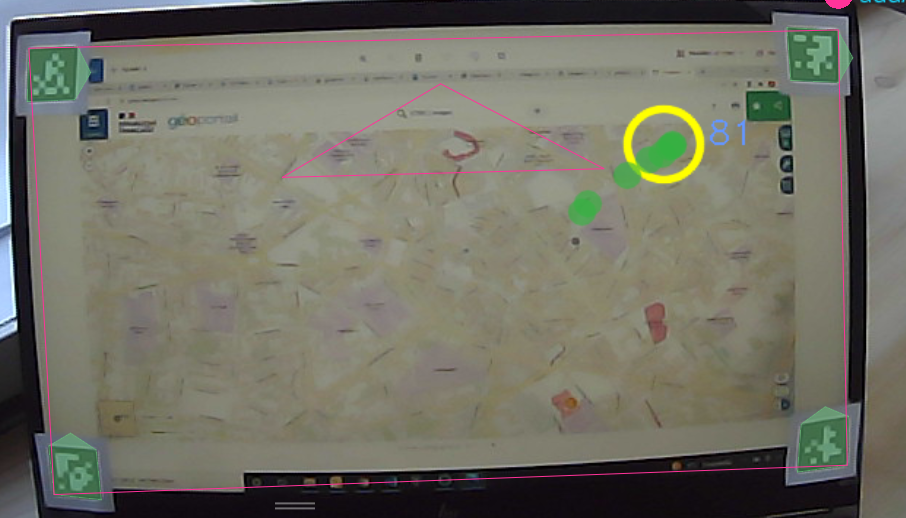
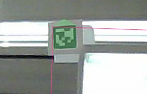
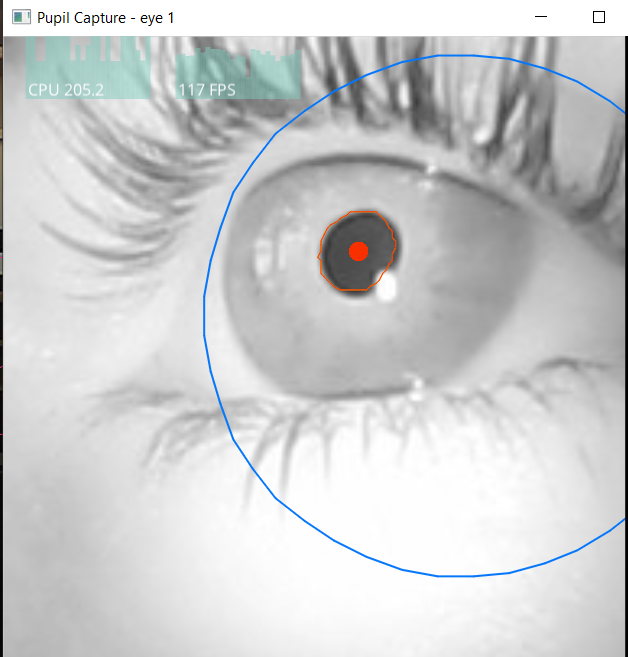

# eye_tracking

# Comment utiliser l'Eye-tracker de Pupil Labs pour l'enquête de la semaine Eiffel :

## 1 Mise en place de l'enquête

### 1.1 Mise en place de l'espace de travail
Il Faut définir la surface de l'écran à l'aide de marqueurs. Il faut les possitionner comme l'exemple suivant.

Attention, la surface est défini selon les coins extérieurs des marqueurs. Il faut faire attention d'aligner les coins extérieurs avec les coins de l'écran et ne pas faire comme l'exemple suivant. 

Avant de commencer l'enquête, il faut vérifier que l'ET détecte bien les marqueurs. Lorsqu'ils sont détéctés, ils sont surlignés en vert dans l'application. si ils ne sont pas détéctés il faut ajuster la lumière pour une meilleure détection.

Si pendant l'enquête un marquer est détécté defaçon discontinue, c'est pas grave, l'application est capable de recalculer sa place.

### 1.2 Lancement de l'application web

La machine sur laquelle tourne l'enquête doit avoir d'installer Node.
Lancer dans un terminal "node serveur.js" à cette adresse.
Puis se rendre sur : localhost:3000/index.html

### 1.3  Ouverture de pupil Capture
Ouvrir l'application et connecter l'eye-tracker

## 2 Enquête :

### 2.1 Acceuil du candidat :
Il faut expliquer le but de l'enquête au candidat et lui demander de valider le formulaire de consentement

### 2.1 Calibration 
Il est possible d'utiliser l'ET avec des lunettes. La calibration est seulement un peu plus compliqué à faire.
Pour chaque oeil il est nécéssaire de regler manuellement les caméras. Il faut vérifier que la caméra arrive correctement à détécter la pupille de la personne (cercle rouge). Pour une meilleur ajustation, demander à l'utilisateur de regarder dans différentes directin pour voir si la caméra ne perd pas la pupille 
 

Il faut demander à l'utilisateur de se placer dans un prmeier temps face à l'ordinateur ou l'enquête sera effectué pour regler la caméra frontale. 
### 2.2 Calibration of the glasses
LAa calibration des lunettes se fait à l'aide de l'interface de pupil Capture
La calibration se fait sur l'ordinateur 
Avant de lancer la calibration, il faut donner quelques consignes. L'utilisateur **ne doit pas bouger la tête pendant la calibration** mais pourrait bouger un peu après celle-ci mais pas de façon excessive et il ne faut surtout pas qu'il touche les lunettes après.

L'utilisateur va alors devoir regarder 5 cibles sur l'écran. Pour lancer la calibration il faut séléctionner l'icone suivante:
 

Il est important de tester la précision après l'avoir effectué. Il faut demander à l'utilisateur de regarder plusieurs points, si il y a une différente assez significative il faut refaire la calibration.

## 3 Enquête

### 3.1 Lancement de l'enquête
Il faut rappeler les consignes à l'utilisateur.

L'accompagnateur va renseigner le numéro et la lettre donner par la personne en face, lancer l'acquisition avec le bouton suivant
 
Une fois l'enregistrement lané, il faut redonner la sourris à l'utilisateur et il peut commencer l'enqûete

### 3.2 The acquisition

Pendant l'enregistrement il faut vérifier que l'utilisateur ne baisse pas trop la tête.
Une fois que la personne a validé l'endroit qu'il doit trouver il faut arrêter l'enregistrement avec le même bouton que pour le lancement

### 3.3 Deuxième session
Avant de lancer la deuxième session il faut lui rappeler les consignes. Une fois dites, il faut lancer l'enregistrement puis lancer l'enqûete. 
Lorsque la carte disparait il faut finit l'enregistrement. Il peut alors enlever les lunettes. Avant de passer à l'ordinateur suivant il faut lui donner son numéro.

## sauvegarde des données.

Pour chaque candidats il faut enregistrer les données dans des dossiers séparés (il faut incrémenter à chaque fois)
ici : C:\Users\lwenclik.IGN\Documents\LostInZoom\semaine_eiffel\resultat

il faut recupérer les deux fichier qui ont téléchargé ainsi que les deux fichiers d'enregistrement de l'ET ici : C:\Users\lwenclik.IGN\recordings